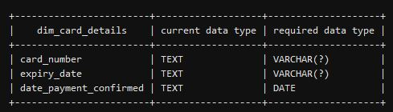

# Multinational-retail-data-centralisation (MRDC)

## Table of Contents
[Project Brief](#project-brief)
[The Data](#the-data)
[Project Dependencies](#project-brief)
[Tools Used](#tools-used)
[Installation](#installation-instructions)
[License](#license)
[Features](#features)

## Project Brief

The aim of this project is to use various Python cloud tools and data extractors (such as Boto3, SQLAlchemy, tabular-py, json) to make my own OOP-based Python package for extracting and cleaning data and having the option to upload to a cloud database. I have achieved these aims and made a Python package with tools that can perform these tasks.

## The Data

In this section I show the architecture of the various tables used in this project for which I extracted the data. The tables show the format that the data came in and the changes I made to keep the data storage-efficient.

The MRDC data is comprised of multiple tables relating to:
- User data 

- Customer card details

- Store data

- Product data

- Orders data

- Date times data

## Project Dependencies
To run this project, the following packages need to be installed (I have provided a requirements.txt file which can be used to install these)
- Boto3 
- Pandas 
- SQLAlchemy 
- PyYAML 

## Tools Used
- [Boto3](https://aws.amazon.com/sdk-for-python/) to interface with AWS programmatically. From the [documentation](https://boto3.amazonaws.com/v1/documentation/api/latest/index.html):
> You use the AWS SDK for Python (Boto3) to create, configure, and manage AWS services, such as Amazon Elastic  Compute Cloud (Amazon EC2) and Amazon Simple Storage Service (Amazon S3). The SDK provides an object-oriented API as well as low-level access to AWS services.
- [Pandas](https://pandas.pydata.org/) for housing and cleaning the extracted data. From the [documentation](https://pandas.pydata.org/docs/):
> Pandas is an open source, BSD-licensed library providing high-performance, easy-to-use data structures and data analysis tools for the Python programming language.
- [SQLAlchemy](https://www.sqlalchemy.org/) for creating an engine that allows connecting to data sources for programmatic extraction. From the website:
> SQLAlchemy is the Python SQL toolkit and Object Relational Mapper that gives application developers the full power and flexibility of SQL. It provides a full suite of well known enterprise-level persistence patterns, designed for efficient and high-performing database access, adapted into a simple and Pythonic domain language.
- [PyYAML](https://pyyaml.org/) for creating files containing data necessary to create SQLAlchemy engines.From the website:
>PyYAML is a full-featured YAML framework for the Python programming language.
- [Requests](https://requests.readthedocs.io/en/latest/) for writing API calls that extract data. From the documentation:
> Requests is an elegant and simple HTTP library for Python, built for human beings. Requests allows you to send HTTP/1.1 requests extremely easily. There’s no need to manually add query strings to your URLs, or to form-encode your POST data. Keep-alive and HTTP connection pooling are 100% automatic, thanks to urllib3.
- [PGAdmin4](https://www.pgadmin.org/) for interacting with the database - to update the schema using CRUD operations and query the tables.
- [PostgreSQL](https://www.postgresql.org/) as the SQL Engine running inside PGAdmin4. From the website:
> PostgreSQL is a powerful, open source object-relational database system with over 35 years of active development that has earned it a strong reputation for reliability, feature robustness, and performance. 

## Installation instructions

Clone the repo using `git clone https://github.com/Qwandy/multinational-retail-data-centralisation`, create a virtual environment using `python<version> -m venv <virtual-environment-name>`, activate it and then type `pip install -r requirements.txt` into your terminal to install the dependencies. This will give you functional access to the code. You should familiarise yourself with the methods in the Python file if you wish to explore and use them in your own code. 'data_cleaning.py' contains the DataCleaning class, 'data_extraction.py' contains the DataExtractor class and 'database_utils.py' contains the DatabaseConnector class. You can import these py files to your own code to use the methods within the classes.

## License

No License. Use this code as you please.

## Features
- Data extracting, cleaning, and cloud compting package to explore.
- SQL Database engineering and data querying files.

